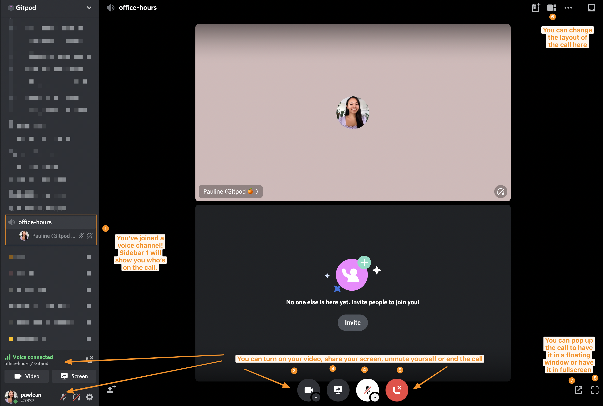

# Gitpod Community Office Hours

We started hosting weekly Community Office Hours every Wednesday at 5:30PM CET ([What time is that where you live? Check here!](https://www.timeanddate.com/worldclock/converter.html?iso=20211216T163000&p1=tz_gmt&p2=tz_cet&p3=tz_pt&p4=240)) on our [community Discord server.](https://www.gitpod.io/chat) Also see [the internal RFC](https://www.notion.so/gitpod/Gitpod-Community-Office-Hours-e85cc0d0a92644409635956292bf6b01) on this proposal.

As we wanted to make sure that these office hours are as inclusive and a safe space as possible, we do not record them. However, we will always have folks writing notes throughout and this is where they will live!

Feel free to raise a PR if you took notes of your own and want to add it here. 🧡

## Getting started

👋🏼 Join our Discord server [here.](https://www.gitpod.io/chat)

_**Top tip:** Head over to `getting-started` channel where you can learn about how to use Gitpod's Discord._

If you join one of our office hours, this is what you can expect:

📝 There is never any pressure for you to switch your mic or camera on, you can just listen in the background.

💬 There is an accompanying `#office-hours-text` where you can type responses/questions there if you'd prefer.

🚫 In some cases, moderators mute you if you accidentally unmute yourself and someone else is talking.

❓ Have a question? Drop them over at `#office-hours-text` before our next session or feel free to raise an issue in this repo!

## Don't miss our next Gitpod Community Hour!

📅 Access our public Google calendar [is avaliable here](https://calendar.google.com/calendar/embed?src=c_pjqbs3u9afudmb2ebjb701eph8%40group.calendar.google.com&ctz=Europe%2FLondon)

- Subscribe to this Google Calendar by adding `c_pjqbs3u9afudmb2ebjb701eph8@group.calendar.google.com` to your Google Calendar.
- The iCal version [is avaliable here.](https://calendar.google.com/calendar/ical/c_pjqbs3u9afudmb2ebjb701eph8%40group.calendar.google.com/public/basic.ics)
